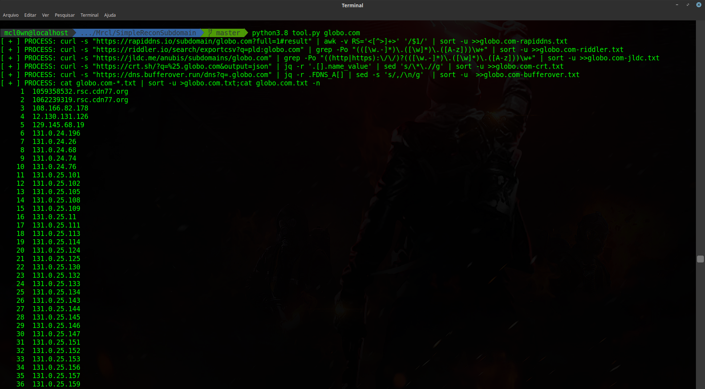
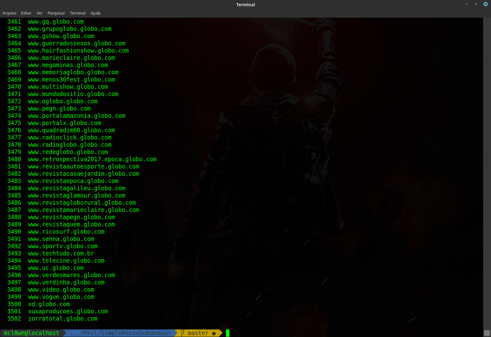

# SimpleReconSubdomain
This is very basic automated recon script tool.

[](https://www.python.org/)
[]()
[]()

```
Autor:    MrCl0wn
Blog:     http://blog.mrcl0wn.com
GitHub:   https://github.com/MrCl0wnLab
Twitter:  https://twitter.com/MrCl0wnLab
Email:    mrcl0wnlab\@\gmail.com
```
## USE
```
python tool.py {domain}
python tool.py fbi.gov
```


## TARGET IS A MAGIC STRING
```bash
curl -s "https://rapiddns.io/subdomain/TARGET?full=1#result" | awk -v RS='<[^>]+>' '/$1/' | sort -u >>TARGET-rapiddns.txt

curl -s "https://rapiddns.io/subdomain/TARGET?full=1#result" | awk -v RS='<[^>]+>' '/$1/' | sort -u >>TARGET-rapiddns.txt

curl -s "https://riddler.io/search/exportcsv?q=pld:TARGET" | grep -Po "(([\w.-]*)\.([\w]*)\.([A-z]))\w+" | sort -u >>TARGET-riddler.txt

curl -s "https://jldc.me/anubis/subdomains/TARGET" | grep -Po "((http|https):\/\/)?(([\w.-]*)\.([\w]*)\.([A-z]))\w+" | sort -u >>TARGET-jldc.txt

curl -s "https://crt.sh/?q=%25.TARGET&output=json" | jq -r '.[].name_value' | sed 's/\*\.//g' | sort -u >>TARGET-crt.txt

curl -s "https://dns.bufferover.run/dns?q=.TARGET" | jq -r .FDNS_A[] | sed -s 's/,/\\n/g'  | sort -u  >>TARGET-bufferover.txt

cat TARGET-*.txt | sort -u >TARGET.txt;cat TARGET.txt -n
```
## OUTPUT
```
TARGET-rapiddns.txt
TARGET-riddler.txt
TARGET-jldc.txt
TARGET-crt.txt
TARGET-bufferover.txt
```
## OUTPUT SORT UNIQ
```
TARGET.txt
```
### Th4nk Y0u
```
@ofjaaah
```
